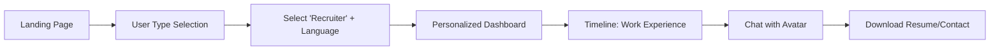
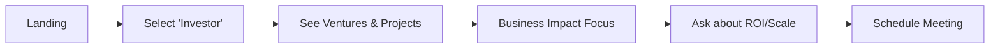
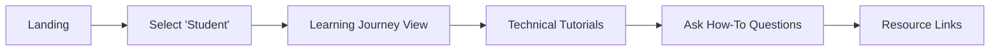
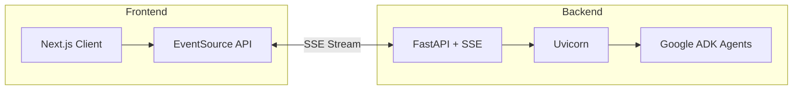
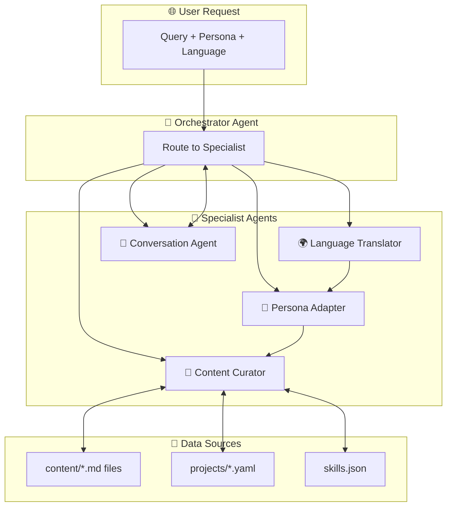
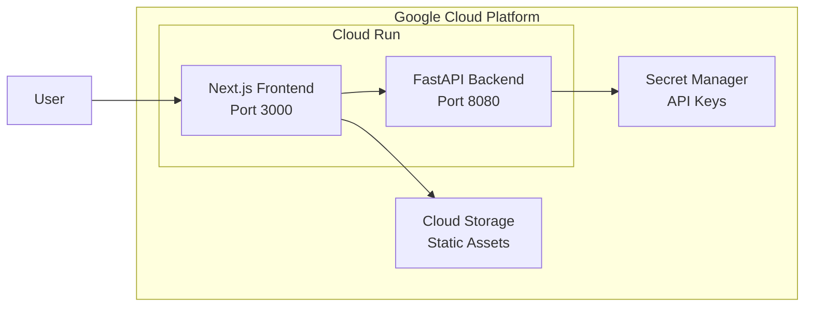

# AI-Powered Portfolio Website - Implementation Plan
## For Vishwajeet Singh Thakur

---

## Executive Summary

An interactive, AI-powered portfolio website featuring a multi-agent backend that dynamically generates personalized content based on user personas. The experience includes real-time streaming responses, emotion-aware interactions, timeline-based navigation, and a 2D conversational avatar.

---

## 1. User Journeys

### Journey 1: First-Time Visitor (Recruiter)


| Step | User Action | System Response |
|------|-------------|-----------------|
| 1 | Arrives at landing page | Show elegant splash with persona selector |
| 2 | Selects "Recruiter" + "English" | AI agents activate to curate recruiter-focused content |
| 3 | Views personalized dashboard | Timeline shows career milestones, skills highlighted |
| 4 | Clicks timeline node | Streaming content appears about that experience |
| 5 | Types question in chat | Avatar responds with relevant project details |
| 6 | Fast scrolling detected | System summarizes content, offers to skip to key points |

### Journey 2: Investor/Entrepreneur


- Focus on: Business impact, scalability, market potential
- Content priority: Entrepreneurial ventures, measurable outcomes, vision

### Journey 3: Student/Learner


- Focus on: Learning path, technical deep-dives, mentorship opportunities
- Content priority: Open-source contributions, tech stack explanations

### Journey 4: Returning Visitor
- System remembers user type via localStorage
- Shows "Continue as [Persona]" or switch option
- Tracks previously explored sections

---

## 2. User Interfaces and UX

### 2.1 Layout Architecture

```
┌─────────────────────────────────────────────────────────────────┐
│  VISHWAJEET SINGH THAKUR     [Timeline Navigation →→→→→→→→→→] │
├─────────────────────────────────────────────────────────────┬───┤
│                                                             │   │
│                                                             │ P │
│                   STREAMING CONTENT                         │ R │
│                      CONTAINER                              │ O │
│                                                             │ F │
│              (AI-generated, persona-aware                   │ I │
│                 markdown rendering)                         │ L │
│                                                             │ E │
│                                                             │   │
├─────────────────────────────────────────────────────────────┤ P │
│  [2D Avatar] │        Chat Input Box                   [↑] │ I │
│              │  "Ask me about my projects..."              │ C │
└─────────────────────────────────────────────────────────────┴───┘
```

### 2.2 Component Breakdown

| Component | Description | Behavior |
|-----------|-------------|----------|
| **Name Heading** | Large, premium typography at top-left | Acts as home button, subtle animation |
| **Timeline Navigation** | Horizontal scrollable on desktop, vertical on mobile | Interactive nodes, shows progress |
| **Content Container** | Central 60% of screen | Markdown → HTML rendering, streaming text effect |
| **Profile Sidebar** | Rounded image with orbital rings animation | "Solar system" effect, subtle rotation |
| **Chat Input** | Fixed bottom bar | Supports markdown, voice input future |
| **2D Avatar** | Animated character beside chat | Lip-sync to responses, emotional expressions |

### 2.3 Responsive Design Breakpoints

| Viewport | Layout Change |
|----------|---------------|
| Desktop (≥1024px) | Full horizontal layout as shown above |
| Tablet (768-1023px) | Profile moves above content, timeline shrinks |
| Mobile (<768px) | Vertical timeline (left edge), profile becomes header circle |

### 2.4 Emotion Tracking UX Adaptations

| Detected Behavior | Interpretation | System Response |
|-------------------|----------------|-----------------|
| Fast scrolling (>500px/s) | User is in a hurry | Show summary mode, offer "Quick Overview" |
| Paused 5+ seconds on section | Confused/interested | Popup "Need more details?" with avatar |
| Rapid clicking without reading | Exploring | Simplify navigation, highlight key sections |
| Idle >30 seconds | Distracted | Subtle animation to re-engage |

---

## 3. Themes and Look of the Website

### 3.1 Design System

#### Color Palette

| Token | Light Mode | Dark Mode | Usage |
|-------|------------|-----------|-------|
| `--bg-primary` | `#FAFAFA` | `#0A0A0F` | Main background |
| `--bg-secondary` | `#F0F0F5` | `#12121A` | Cards, containers |
| `--accent-primary` | `#6366F1` | `#818CF8` | CTAs, links, timeline active |
| `--accent-secondary` | `#EC4899` | `#F472B6` | Avatar glow, highlights |
| `--text-primary` | `#1A1A2E` | `#E5E5E5` | Headings |
| `--text-secondary` | `#64748B` | `#94A3B8` | Body text |
| `--gradient-cosmic` | Linear gradient | `hsla(260, 80%, 60%, 0.1) → transparent` | Glow effects |

#### Typography

```css
/* Font Stack */
--font-heading: 'Space Grotesk', 'Inter', system-ui;
--font-body: 'Inter', 'Roboto', system-ui;
--font-mono: 'JetBrains Mono', 'Fira Code', monospace;

/* Scale */
--text-hero: clamp(2.5rem, 6vw, 4.5rem);     /* Name heading */
--text-h1: clamp(1.75rem, 4vw, 2.5rem);      /* Section titles */
--text-body: clamp(0.95rem, 1.5vw, 1.1rem);  /* Content */
```

### 3.2 Visual Style

#### Key Aesthetic Principles
1. **Premium Minimalism**: Clean whitespace, no visual clutter
2. **Cosmic/Tech Theme**: Subtle space-inspired accents (stars, orbits)
3. **Glass Morphism**: Frosted glass cards with `backdrop-filter: blur()`
4. **Micro-animations**: Every interaction has a 150-300ms ease-out response

#### Profile Picture "Solar System" Style
```css
.profile-container {
  position: relative;
  width: 200px;
  height: 200px;
}

.profile-image {
  border-radius: 50%;
  box-shadow: 
    0 0 40px rgba(99, 102, 241, 0.3),
    0 0 80px rgba(236, 72, 153, 0.15);
}

.orbit {
  position: absolute;
  border: 1px solid rgba(255, 255, 255, 0.1);
  border-radius: 50%;
  animation: orbit 20s linear infinite;
}
```

#### Streaming Text Effect
```css
.streaming-text {
  animation: fadeSlideIn 0.3s ease-out;
}

@keyframes fadeSlideIn {
  from { opacity: 0; transform: translateY(8px); }
  to { opacity: 1; transform: translateY(0); }
}
```

### 3.3 Dark/Light Mode Toggle
- Default: Dark mode (matches cosmic theme)
- Toggle: Minimalist sun/moon icon in top-right
- Transition: Smooth 400ms color transitions

---

## 4. Frameworks for Streaming Agent Responses in Real-Time

### 4.1 Recommended Architecture



### 4.2 Backend: Server-Sent Events (SSE) with FastAPI

| Technology | Purpose | Why This Choice |
|------------|---------|-----------------|
| **FastAPI** | API framework | Native async, `StreamingResponse` support |
| **Uvicorn** | ASGI server | Handles concurrent SSE connections efficiently |
| **SSE Protocol** | Streaming | Simpler than WebSockets for one-way streams |

```python
# Example SSE endpoint
from fastapi import FastAPI
from fastapi.responses import StreamingResponse
from google.adk import Agent

app = FastAPI()

async def stream_agent_response(query: str, persona: str):
    agent = Agent(persona=persona)
    async for chunk in agent.generate_stream(query):
        yield f"data: {json.dumps({'text': chunk})}\n\n"
    yield f"data: {json.dumps({'done': True})}\n\n"

@app.get("/api/chat/stream")
async def chat_stream(query: str, persona: str = "general"):
    return StreamingResponse(
        stream_agent_response(query, persona),
        media_type="text/event-stream",
        headers={
            "Cache-Control": "no-cache",
            "Connection": "keep-alive"
        }
    )
```

### 4.3 Frontend: React EventSource Hook

```typescript
// useStreamingResponse.ts
import { useState, useCallback } from 'react';

export function useStreamingResponse() {
  const [content, setContent] = useState('');
  const [isStreaming, setIsStreaming] = useState(false);

  const startStream = useCallback((query: string, persona: string) => {
    setContent('');
    setIsStreaming(true);
    
    const eventSource = new EventSource(
      `/api/chat/stream?query=${encodeURIComponent(query)}&persona=${persona}`
    );
    
    eventSource.onmessage = (event) => {
      const data = JSON.parse(event.data);
      if (data.done) {
        eventSource.close();
        setIsStreaming(false);
      } else {
        setContent(prev => prev + data.text);
      }
    };
    
    eventSource.onerror = () => {
      eventSource.close();
      setIsStreaming(false);
    };
  }, []);

  return { content, isStreaming, startStream };
}
```

### 4.4 Alternative: WebSocket (If Bidirectional Needed)
- Use for: Real-time avatar lip-sync, continuous user behavior tracking
- Library: `starlette.websockets` + `socket.io-client`

---

## 5. Frameworks for Timeline Navigation

### 5.1 Recommended Libraries

| Library | Stars | Bundle Size | Best For |
|---------|-------|-------------|----------|
| **react-chrono** | 3.8k+ | ~45KB | Rich timeline with cards, modes |
| **framer-motion** | 20k+ | ~150KB | Custom animations, gestures |
| **react-vertical-timeline** | 1.5k+ | ~15KB | Lightweight vertical option |
| **Custom CSS Scroll Snap** | N/A | ~2KB | Maximum performance |

### 5.2 Recommended Approach: Hybrid Custom + Framer Motion

```tsx
// Timeline.tsx
import { motion } from 'framer-motion';
import { useRef } from 'react';

interface TimelineNode {
  id: string;
  year: string;
  title: string;
  active: boolean;
}

export function Timeline({ nodes, onNodeClick }: Props) {
  const containerRef = useRef<HTMLDivElement>(null);

  return (
    <div 
      ref={containerRef}
      className="timeline-container"
      style={{ 
        display: 'flex',
        overflowX: 'auto',
        scrollSnapType: 'x mandatory'
      }}
    >
      {nodes.map((node, index) => (
        <motion.button
          key={node.id}
          onClick={() => onNodeClick(node.id)}
          whileHover={{ scale: 1.1 }}
          whileTap={{ scale: 0.95 }}
          animate={{ 
            backgroundColor: node.active ? 'var(--accent-primary)' : 'transparent'
          }}
          className="timeline-node"
          style={{ scrollSnapAlign: 'center' }}
        >
          <span className="year">{node.year}</span>
          <span className="title">{node.title}</span>
        </motion.button>
      ))}
    </div>
  );
}
```

### 5.3 Mobile Vertical Timeline

```css
@media (max-width: 768px) {
  .timeline-container {
    flex-direction: column;
    position: fixed;
    left: 0;
    top: 80px;
    width: 60px;
    height: calc(100vh - 80px);
    overflow-y: auto;
    scroll-snap-type: y mandatory;
  }
  
  .timeline-node {
    writing-mode: vertical-rl;
    scroll-snap-align: start;
  }
}
```

---

## 6. Multi-Agent System Design (Google ADK / Vertex AI)

### 6.1 Agent Architecture



### 6.2 Agent Definitions

#### Agent 1: Orchestrator (Manager)
```python
# orchestrator_agent.py
from google.adk import Agent, Tool

class OrchestratorAgent(Agent):
    """Routes user queries to appropriate specialist agents."""
    
    system_instruction = """
    You are the portfolio orchestrator. Analyze user queries and route to:
    - content_curator: For factual information about experiences, projects
    - persona_adapter: For tailoring content to user type (recruiter/investor/student)
    - translator: For non-English language requests
    - conversation: For general chat/questions
    
    Always consider the user persona when routing.
    """
    
    tools = [
        Tool(name="route_to_agent", handler=route_to_agent),
        Tool(name="get_user_context", handler=get_user_context),
    ]
```

#### Agent 2: Content Curator
```python
# content_curator_agent.py
class ContentCuratorAgent(Agent):
    """Retrieves and synthesizes content from markdown files."""
    
    system_instruction = """
    You curate portfolio content from the /content directory.
    Always cite sources and maintain factual accuracy.
    Format output in clean markdown suitable for streaming.
    """
    
    tools = [
        Tool(name="read_markdown", handler=read_markdown_file),
        Tool(name="search_projects", handler=search_projects),
        Tool(name="get_skills", handler=get_skills_data),
    ]
```

#### Agent 3: Persona Adapter
```python
# persona_adapter_agent.py
class PersonaAdapterAgent(Agent):
    """Adapts content tone and focus based on user persona."""
    
    system_instruction = """
    Transform content based on user persona:
    - Recruiter: Emphasize skills, achievements, metrics, team collaboration
    - Investor: Focus on innovation, scalability, business impact, vision
    - Student: Highlight learning journey, technical depth, mentorship
    - General: Balanced, accessible overview
    
    Maintain authenticity while optimizing relevance.
    """
```

#### Agent 4: Language Translator
```python
# translator_agent.py
class TranslatorAgent(Agent):
    """Translates content to user's preferred language."""
    
    system_instruction = """
    Translate portfolio content naturally to the target language.
    Preserve:
    - Technical terms (optionally with translations in parentheses)
    - Proper nouns
    - Code snippets
    
    Adapt cultural references appropriately.
    """
```

#### Agent 5: Conversation Agent
```python
# conversation_agent.py
class ConversationAgent(Agent):
    """Handles interactive Q&A with personality."""
    
    system_instruction = """
    You are Vishwajeet's portfolio assistant avatar.
    Personality: Friendly, professional, enthusiastic about technology.
    
    Answer questions about:
    - Projects and experiences
    - Skills and technologies
    - Career goals and interests
    
    If unsure, say so honestly and offer to show relevant content.
    """
```

### 6.3 Agent Communication Flow

```python
# main.py - Multi-agent orchestration
from google.adk import AgentRunner

async def handle_query(query: str, persona: str, language: str):
    runner = AgentRunner()
    
    # Step 1: Orchestrator decides routing
    route = await runner.run(
        OrchestratorAgent,
        input=f"User ({persona}, {language}): {query}"
    )
    
    # Step 2: Content curation
    content = await runner.run(
        ContentCuratorAgent,
        input=route.target_query
    )
    
    # Step 3: Persona adaptation
    adapted = await runner.run(
        PersonaAdapterAgent,
        input=content.output,
        context={"persona": persona}
    )
    
    # Step 4: Translation (if needed)
    if language != "en":
        final = await runner.run(
            TranslatorAgent,
            input=adapted.output,
            context={"target_language": language}
        )
    else:
        final = adapted
    
    return final.output
```

### 6.4 Content Structure

```
content/
├── about/
│   └── profile.md
├── experience/
│   ├── company-a.md
│   ├── company-b.md
│   └── _metadata.yaml
├── projects/
│   ├── project-1.md
│   ├── project-2.md
│   └── _metadata.yaml
├── skills/
│   └── skills.json
└── blog/
    └── *.md
```

---

## 7. GCP Cloud Run Deployment

### 7.1 Architecture Overview



### 7.2 Project Structure

```
portfolio/
├── frontend/
│   ├── Dockerfile
│   ├── package.json
│   ├── next.config.js
│   └── src/
├── backend/
│   ├── Dockerfile
│   ├── requirements.txt
│   ├── main.py
│   └── agents/
├── content/
│   └── *.md
├── docker-compose.yml
└── cloudbuild.yaml
```

### 7.3 Backend Dockerfile

```dockerfile
# backend/Dockerfile
FROM python:3.11-slim

WORKDIR /app

# Install dependencies
COPY requirements.txt .
RUN pip install --no-cache-dir -r requirements.txt

# Copy application
COPY . .

# Expose port
EXPOSE 8080

# Run with uvicorn
CMD ["uvicorn", "main:app", "--host", "0.0.0.0", "--port", "8080"]
```

### 7.4 Frontend Dockerfile

```dockerfile
# frontend/Dockerfile
FROM node:20-alpine AS builder

WORKDIR /app
COPY package*.json ./
RUN npm ci

COPY . .
RUN npm run build

FROM node:20-alpine AS runner
WORKDIR /app

ENV NODE_ENV=production
COPY --from=builder /app/public ./public
COPY --from=builder /app/.next/standalone ./
COPY --from=builder /app/.next/static ./.next/static

EXPOSE 3000
CMD ["node", "server.js"]
```

### 7.5 Deployment Steps

#### Step 1: Setup GCP Project
```bash
# Set project
export PROJECT_ID="vishwajeet-portfolio"
gcloud config set project $PROJECT_ID

# Enable APIs
gcloud services enable \
  run.googleapis.com \
  cloudbuild.googleapis.com \
  secretmanager.googleapis.com \
  artifactregistry.googleapis.com
```

#### Step 2: Create Artifact Registry
```bash
gcloud artifacts repositories create portfolio-repo \
  --repository-format=docker \
  --location=us-central1
```

#### Step 3: Store Secrets
```bash
# Store Gemini API key
echo -n "YOUR_GEMINI_API_KEY" | \
  gcloud secrets create gemini-api-key --data-file=-

# Grant Cloud Run access
gcloud secrets add-iam-policy-binding gemini-api-key \
  --member="serviceAccount:$PROJECT_NUMBER-compute@developer.gserviceaccount.com" \
  --role="roles/secretmanager.secretAccessor"
```

#### Step 4: Deploy Backend
```bash
cd backend

# Build and push
gcloud builds submit --tag us-central1-docker.pkg.dev/$PROJECT_ID/portfolio-repo/backend

# Deploy to Cloud Run
gcloud run deploy portfolio-backend \
  --image us-central1-docker.pkg.dev/$PROJECT_ID/portfolio-repo/backend \
  --region us-central1 \
  --allow-unauthenticated \
  --timeout=300 \
  --set-secrets="GEMINI_API_KEY=gemini-api-key:latest" \
  --memory=1Gi \
  --cpu=1
```

#### Step 5: Deploy Frontend
```bash
cd frontend

# Build with backend URL
gcloud builds submit \
  --tag us-central1-docker.pkg.dev/$PROJECT_ID/portfolio-repo/frontend \
  --build-arg NEXT_PUBLIC_API_URL="https://portfolio-backend-xxxxx.run.app"

# Deploy
gcloud run deploy portfolio-frontend \
  --image us-central1-docker.pkg.dev/$PROJECT_ID/portfolio-repo/frontend \
  --region us-central1 \
  --allow-unauthenticated \
  --memory=512Mi
```

#### Step 6: Configure Custom Domain (Optional)
```bash
gcloud run domain-mappings create \
  --service portfolio-frontend \
  --domain vishwajeetthakur.com \
  --region us-central1
```

### 7.6 CI/CD with Cloud Build

```yaml
# cloudbuild.yaml
steps:
  # Build and deploy backend
  - name: 'gcr.io/cloud-builders/docker'
    args: ['build', '-t', 'us-central1-docker.pkg.dev/$PROJECT_ID/portfolio-repo/backend', './backend']
  
  - name: 'gcr.io/cloud-builders/docker'
    args: ['push', 'us-central1-docker.pkg.dev/$PROJECT_ID/portfolio-repo/backend']
  
  - name: 'gcr.io/google.com/cloudsdktool/cloud-sdk'
    entrypoint: gcloud
    args:
      - 'run'
      - 'deploy'
      - 'portfolio-backend'
      - '--image'
      - 'us-central1-docker.pkg.dev/$PROJECT_ID/portfolio-repo/backend'
      - '--region'
      - 'us-central1'
      
  # Build and deploy frontend
  - name: 'gcr.io/cloud-builders/docker'
    args: ['build', '-t', 'us-central1-docker.pkg.dev/$PROJECT_ID/portfolio-repo/frontend', './frontend']
  
  - name: 'gcr.io/cloud-builders/docker'
    args: ['push', 'us-central1-docker.pkg.dev/$PROJECT_ID/portfolio-repo/frontend']
  
  - name: 'gcr.io/google.com/cloudsdktool/cloud-sdk'
    entrypoint: gcloud
    args:
      - 'run'
      - 'deploy'
      - 'portfolio-frontend'
      - '--image'
      - 'us-central1-docker.pkg.dev/$PROJECT_ID/portfolio-repo/frontend'
      - '--region'
      - 'us-central1'
```

---

## 8. Implementation Phases

### Phase 1: Foundation (Week 1-2)
- [ ] Setup Next.js project with TypeScript
- [ ] Implement design system (CSS variables, typography)
- [ ] Create layout components (Header, Sidebar, Content area)
- [ ] Build timeline navigation component

### Phase 2: Backend Core (Week 2-3)
- [ ] Setup FastAPI project structure
- [ ] Implement SSE streaming endpoint
- [ ] Create base Agent classes with Google ADK
- [ ] Build Content Curator agent with markdown parsing

### Phase 3: Agent System (Week 3-4)
- [ ] Implement Orchestrator agent
- [ ] Build Persona Adapter agent
- [ ] Create Language Translator agent
- [ ] Develop Conversation agent for Q&A

### Phase 4: Frontend Integration (Week 4-5)
- [ ] Connect streaming to frontend
- [ ] Implement persona selection flow
- [ ] Build chat interface with avatar placeholder
- [ ] Add emotion tracking logic

### Phase 5: Polish & Deploy (Week 5-6)
- [ ] Add 2D avatar animations
- [ ] Performance optimization
- [ ] Mobile responsiveness testing
- [ ] Deploy to Cloud Run
- [ ] Setup CI/CD pipeline

---

## 9. Technology Stack Summary

| Layer | Technology |
|-------|------------|
| **Frontend** | Next.js 14, React 18, TypeScript, Framer Motion |
| **Styling** | Vanilla CSS with CSS Variables, Google Fonts |
| **Backend** | FastAPI, Python 3.11, Uvicorn |
| **AI/ML** | Google ADK, Vertex AI, Gemini API |
| **Streaming** | Server-Sent Events (SSE) |
| **Deployment** | GCP Cloud Run, Cloud Build, Artifact Registry |
| **Storage** | Cloud Storage (static), Secret Manager (keys) |

---

## 10. Open Questions for Review

> [!IMPORTANT]
> Please review and provide feedback on the following:

1. **Avatar Technology**: Should we use a simple animated SVG avatar or integrate a more sophisticated solution like Ready Player Me?

2. **Language Support**: Which languages should be prioritized for translation? (Hindi, Spanish, French, etc.)

3. **Content Sources**: Are all content files going to be in the `/content` folder, or do you have existing content elsewhere?

4. **Domain**: Do you have a custom domain ready, or should we proceed with the default Cloud Run URL initially?

5. **Analytics**: Should we integrate Google Analytics or a privacy-focused alternative like Plausible?

---

*This plan is ready for review. Once approved, we'll begin implementation following the phased approach.*
